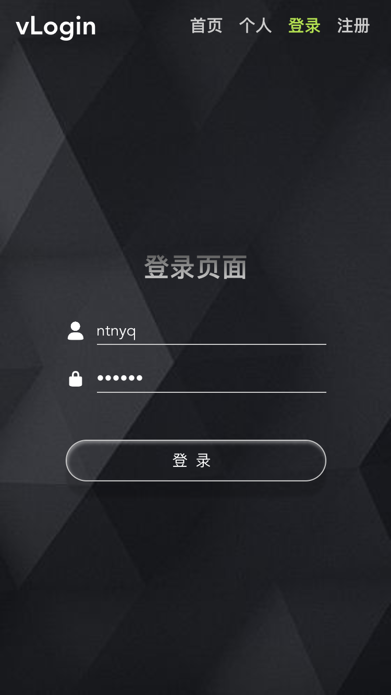

# vue-login
---

基于**Vue**、**Express**和**MongoDB**的持久化登录DEMO。

## 使用

> 前置环境需求
> > - Yarn
> > - MongoDB

``` bash
# 克隆本项目
$ git clone https://github.com/ntnyq/vue-login-demo.git

# 进入项目目录
cd vue-login-demo

# 安装依赖
$ yarn

# 运行前端代码
$ yarn dev

# 运行mongodb 需要电脑上
$ mongod --config /your_path_to/config_file
$ mongo

# 运行后端代码
$ yarn server
```

## 依赖模块

- **vue** 前端js框架
- **vuex** 前端状态管理
- **vue-router** 前端路由
- **axios** 数据请求库
- **bcryptjs** 密码加密库
- **express-jwt** jwt中间件，用于验证Token
- **cors** cors中间件，用于跨域资源共享
- **dotenv** 导入自定义环境变量`process.env`
- **jsonqwebtoken** 生成token，做HTTPS连接记录
- **keymirror** 映射`mutation-types`
- **mongoose** 连接操作MongoDB数据库
- **morgan** expresa中间件，开发日志
- **qs** 协助`axios`数据请求，通过拦截器改变传参方式
- **lodash** 常用工具函数库

## 截图

### 登录前



### 登录后


